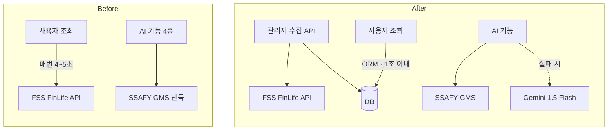
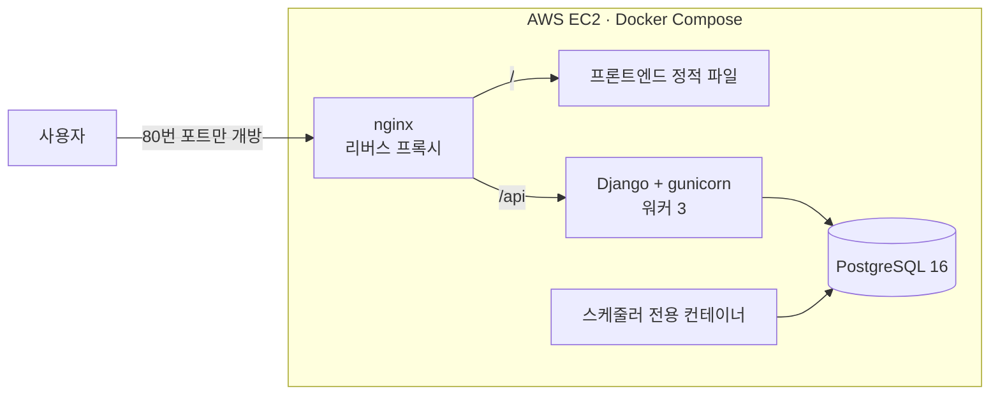

### 외부 API 장애는 대체 경로로 막고, 4~5초 걸리던 조회는 1초 안으로 줄였습니다

 

## 👤 About

경북대학교 컴퓨터학부 글로벌소프트웨어융합전공(복수전공, 51학점)으로 개발을 시작했고, SSAFY 15기 2학기 과정에 있습니다.

| 핵심역량 | 근거 | 수치 |
|---|---|---|
| **외부 의존성 장애 대응** | FinFit: 느린 API는 요청 경로에서 분리, 멈춘 API는 대체 경로로 전환 | 조회 **4~5초 → 1초 이내** |
| **서비스를 끝까지 띄우는 실행력** | FinFit을 3개월 뒤 다시 열어 AWS EC2에 직접 배포 | 인프라 문제 **4건** 해결 · 앱 오류 **0건** |
| **판단 기준을 직접 설계** | AI 추천을 맡기기 전에 평가 기준을 정의해 프롬프트에 결합 | 기준 **4개** (40 · 30 · 15 · 15) |

**자격** 정보처리기사 · SQLD · ADsP · 컴퓨터활용능력 1급

 

## 🛠 Tech Stack

| 숙련도 | 기술 | 어디서 썼나 |
|:---:|---|---|
| **고급** 프로젝트에서 주도적으로 활용 |     | FinFit 백엔드 API 전 범위 |
| |   | SSabway 화면 17개 |
| **중급** 문서를 보며 독립 개발 |     | SQLD · SSAFY 학습 · SSabway |
| |     | FinFit 운영 배포 · 팀 협업 |
| **초급** 예제를 참고해 구현 |    | FinFit 운영 배포 1회 (상시 운영 경험 없음) |

 

## 📂 Projects

### 1. FinFit · 금융성향 기반 금융상품 추천 서비스

금융성향 검사 결과에 맞춰 예·적금, 주식, 카드를 추천하고 AI 상담을 제공하는 서비스입니다. 
**내 역할** 인증·금융상품·추천·주식·뉴스·AI 상담 API 설계·구현, 외부 API 5종 연동 · 프론트엔드(Vue)는 팀원 담당

<table>
<tr>
<td align="center" width="33%">상품 조회 시간 <h3>4~5초 → 1초 이내</h3>75% 이상 단축</td>
<td align="center" width="33%">외부 AI API 장애 <h3>단일 의존 → 이중화</h3>GMS 실패 시 Gemini 전환</td>
<td align="center" width="33%">AI 추천 <h3>매번 다름 → 기준 4개</h3>상품별 추천 근거 제공</td>
</tr>
</table>

**구조 변화 (Before → After)**

| 기술 선택 | 대안 | 이유 |
|---|---|---|
| Django · DRF | — | 개발 편의성 우선. ORM 덕분에 이후 SQLite → PostgreSQL 전환이 설정 변경만으로 끝남 |
| 상품 데이터 DB 적재 | 요청마다 외부 호출 | 외부 응답이 4~5초라 요청 경로에 둘 수 없음 |
| Gemini Fallback | GMS 단일 의존 | 실제 장애를 겪음. AI 기능 전부가 한 API에 걸린 구조를 해소 |
| SimpleJWT Token Blacklist | 프론트 토큰 삭제만 | 로그아웃 후에도 서버 토큰이 유효하게 남는 문제 차단 |

<b>🔥 트러블슈팅 ① 발표 이틀 전, AI API(GMS) 장애</b>

 

| | |
|---|---|
| **상황** | 잘 되던 번역이 갑자기 멈춤. AI 추천·상담·번역·브리핑이 모두 GMS 한 곳에 연결돼 있었음 |
| **과제** | 원인을 빨리 좁히고, 외부 API 하나의 장애가 서비스 전체 오류로 번지지 않게 해야 함 |
| **행동** | 기획 단계에 외부 API별 담당 기능을 정리해 둔 덕에 바로 GMS로 판단 → Gemini 1.5 Flash를 대체 경로로 추가, 요청 형식 차이는 주소로 분기 → LLM이 JSON을 코드블록으로 감싸 돌려주는 경우도 전처리·예외 처리 |
| **결과** | 외부 API 하나가 멈추거나 응답 형식이 달라져도 서비스 전체 오류로 번지지 않음 |

<b>🔥 트러블슈팅 ② 느린 외부 API를 요청 경로에서 분리</b>

 

| | |
|---|---|
| **상황** | FinLife API 응답 4~5초, 사용자가 상품 목록을 볼 때마다 호출 |
| **과제** | 외부 API는 빠르게 만들 수 없으므로 구조를 바꿔야 함 |
| **행동** | 관리자 전용 수집 API로 상품 데이터를 DB에 적재, 사용자 조회는 Django ORM으로만 처리 |
| **결과** | 조회 **4~5초 → 1초 이내**, 외부 API가 지원하지 않던 검색·정렬·필터링도 ORM으로 구현 |

<b>🔥 트러블슈팅 ③ AI 추천이 매번 달라짐 → 평가 기준 설계</b>

 

| | |
|---|---|
| **상황** | "적합한 상품을 추천해줘"만으로는 결과가 일관되지 않음 |
| **과제** | AI가 따를 판단 기준을 서비스가 정해야 함 |
| **행동** | 금리 경쟁력 40 · 수익 절대액 30 · 상품 유형 적합성 15 · 은행 신뢰도 및 인근 여부 15를 정의해 프롬프트에 결합. 금리만 크게 두니 납입 한도·기간이 짧아 실제 이자는 적은 상품이 위로 올라와, 금리(비율)와 만기 예상 이자(금액)를 별도 항목으로 분리 |
| **결과** | 추천이 일관되고 상품별 근거를 함께 제공. 같은 검사 결과는 저장된 추천을 재사용해 AI 재호출 없음 |

<b>📝 회고 (KPT)</b>

 

- **Keep** 외부 서비스가 항상 정상이라고 가정하지 않았다. 느린 API는 요청 경로에서 떼고, 멈출 수 있는 API에는 대체 경로를 붙였다
- **Problem** 프로젝트 기간 안에 배포하지 못했다. 완성 기준을 로컬 실행으로 좁게 잡고 일정도 그에 맞춘 내 판단의 문제였다. 주식 모의 매수·매도도 기간 안에 붙이지 못했다
- **Try** 처음부터 "외부에서 접속되는 서비스"를 완성 기준으로 잡는다 → 3개월 뒤 실제로 돌아가 배포했다 (아래 1-2)

 

### 1-2. FinFit 운영 배포 · AWS EC2

기간 안에 못 한 배포를 3개월 뒤 다시 열어 마무리했습니다. 시작 전에 팀원에게 알리고, 운영 구성 설계부터 배포·검증·문서화까지 직접 했습니다.

<table>
<tr>
<td align="center" width="33%">서버에서 만난 애플리케이션 오류 <h3>0건</h3>로컬 리허설로 사전 제거</td>
<td align="center" width="33%">인프라 문제 <h3>4건 해결</h3>대응 시간 합계 65분</td>
<td align="center" width="33%">컨테이너 4개 메모리 <h3>469MB</h3>t3.small 실측</td>
</tr>
</table>

| 개발 → 운영 | 바꾼 이유 |
|---|---|
| SQLite 파일 → **PostgreSQL 컨테이너** | 컨테이너를 다시 만들면 파일 DB가 사라짐 |
| runserver 내부 → **스케줄러 전용 컨테이너** | 기존 중복 실행 방지 조건이 gunicorn에서는 동작하지 않고, 워커 3개에서 켜면 같은 작업이 3번 실행됨 |
| CORS 전체 허용 → **설정 불필요** | nginx가 프론트엔드와 API를 같은 출처로 묶음 |
| `127.0.0.1:8000` → **상대경로 `/api`** | 주소가 바뀌어도 다시 빌드할 필요 없음 |

<b>🔥 트러블슈팅 ① 컨테이너는 다 떴는데 외부에서 접속 불가</b>

 

| | |
|---|---|
| **상황** | 컨테이너 4개 모두 실행 중, 서버 안에서는 200인데 외부에서는 15초 타임아웃 |
| **과제** | 애플리케이션 · nginx · OS · 클라우드 중 어디서 막히는지 좁혀야 함 |
| **행동** | 안쪽부터 확인: `localhost` 200 → `ss`로 `0.0.0.0:80` 확인 → `ufw`·`iptables` 무혐의 → **서버에서 자기 공인 IP 호출 시 타임아웃** → 인스턴스 밖(VPC 경계)으로 확정 |
| **결과** | 보안 그룹 인바운드에 HTTP(80) 누락. 추가 후 외부 전 경로 정상 응답 |

<b>🔥 트러블슈팅 ② 빌드 중 디스크 부족</b>

 

| | |
|---|---|
| **상황** | 빌드가 `no space left on device`로 실패, 디스크 여유 212MB |
| **과제** | 디스크가 왜 찼는지 찾고 확장해야 함 |
| **행동** | EBS가 기본값 8GiB로 생성됐고, 메모리 대비로 만든 4GB 스왑 파일이 디스크를 차지하고 있었음 → 볼륨 20GiB로 수정 후 `growpart`·`resize2fs`로 확장 |
| **결과** | **7G → 19G** 확장 후 빌드 성공 |

<b>📝 회고 (KPT)</b>

 

- **Keep** 서버에 올리기 전 로컬에서 운영 구성을 먼저 실행해, 서버에서는 인프라 문제에만 집중했다. 절차와 장애는 [deploy](https://github.com/luster-woo/finance_pjt/tree/master/deploy) 문서로 남겼다
- **Problem** 보안 그룹과 볼륨 크기를 설정했다고 믿고 확인하지 않았다. 도메인이 없어 HTTPS는 적용하지 못했고, 검증 후 인스턴스를 종료해 지금은 접속 주소가 없다
- **Try** 인스턴스 생성 직후 인바운드와 볼륨부터 확인한다. 다음 배포는 도메인과 HTTPS까지 간다

 

### 2. SSabway · AI 표지판 인식 지하철 실내 길안내 · 화상 상담

표지판을 촬영하면 역 안 위치를 인식해 길을 안내하고, 필요하면 상담원과 화상으로 연결하는 서비스입니다. 
**내 역할** 사용자·관리자 화면 17개, OpenVidu 화상 세션, 4개국어, MSW 목 서버 · 백엔드·AI 모델·CI/CD는 팀원 담당

<table>
<tr>
<td align="center" width="33%">담당 화면 <h3>17개</h3>API 3일 지연 중 먼저 개발</td>
<td align="center" width="33%">다국어 <h3>4개국어</h3>한 · 영 · 일 · 중</td>
<td align="center" width="33%">화상 상담 화면 비율 <h3>기기별 편차 → 일치</h3>0.46~0.56 차이 해소</td>
</tr>
</table>

| 기술 선택 | 대안 | 이유 |
|---|---|---|
| MSW 목 서버 (직접 제안) | 백엔드 완성 대기 / 더미 데이터 | 요청·응답을 먼저 정의하면 실제 API가 나왔을 때 화면 코드를 거의 바꾸지 않고 교체 가능 |
| 화면 비율 실시간 측정 | 비율 고정값 | 모바일 주소창에 따라 높이가 바뀌어 고정할 수 없음 |
| Google Maps | 네이버 지도 | 다국어 환경에서 활용도가 부족하다고 판단해 전환 제안 |

<b>🔥 트러블슈팅 ① 화상 상담 중 두 사람이 다른 화면을 봄</b>

 

| | |
|---|---|
| **상황** | 기기마다 화면 비율이 0.46~0.56으로 달라 상담원과 사용자가 다른 영역을 봄 |
| **과제** | 기기와 브라우저 상태에 상관없이 같은 화면을 맞춰야 함 |
| **행동** | 각 브라우저가 자기 비율을 직접 재서 OpenVidu 시그널로 전송 → 입장 순서에 따른 누락은 양방향 전송 + 리스너 선등록 → 값을 못 받으면 기본 비율로 통화 유지 |
| **결과** | 상담원과 사용자가 같은 화면을 보며 안내 가능 |

<b>🔥 트러블슈팅 ② 백엔드 API 3일 지연</b>

 

| | |
|---|---|
| **상황** | 백엔드 API가 일정보다 3일 늦어져 화면 작업이 멈출 상황 |
| **과제** | API 없이도 화면 개발을 계속할 방법이 필요 |
| **행동** | MSW를 강의·예제로 익혀 팀에 도입 제안, 요청·응답 형식을 먼저 정의해 목 서버 구축 |
| **결과** | 담당 화면 **17개**를 먼저 개발하고, 실제 API 완성 후 연결 교체 |

<b>📝 회고 (KPT)</b>

 

- **Keep** 기기마다 달라지는 값은 고정하지 않고 실행 중에 쟀다. 일정 지연은 기다리지 않고 해결 방법을 찾아 팀에 제안했다
- **Problem** 초반에 API 명세가 비어 있어 프론트엔드·백엔드 연동에서 재작업이 반복됐다
- **Try** 화면 개발 전에 화면 단위 API 명세부터 맞춘다

 

## 📚 Etc

| 저장소 | 내용 |
|---|---|
| [codetree](https://github.com/luster-woo/codetree) | 코드트리 **585문제 / 59일** 풀이를 주제별로 정리 |
| [ssafy_gumi_study](https://github.com/luster-woo/ssafy_gumi_study) | 6명이 **3.5개월** 진행한 알고리즘 스터디 · Fork & PR 제출, 상호 코드 리뷰 |
| [TIL](https://github.com/luster-woo/TIL) | SSAFY 1학기 **95일** 학습 기록 |
| [ssafy-pjt](https://github.com/luster-woo/ssafy-pjt) | SSAFY 관통 프로젝트 정리 |

